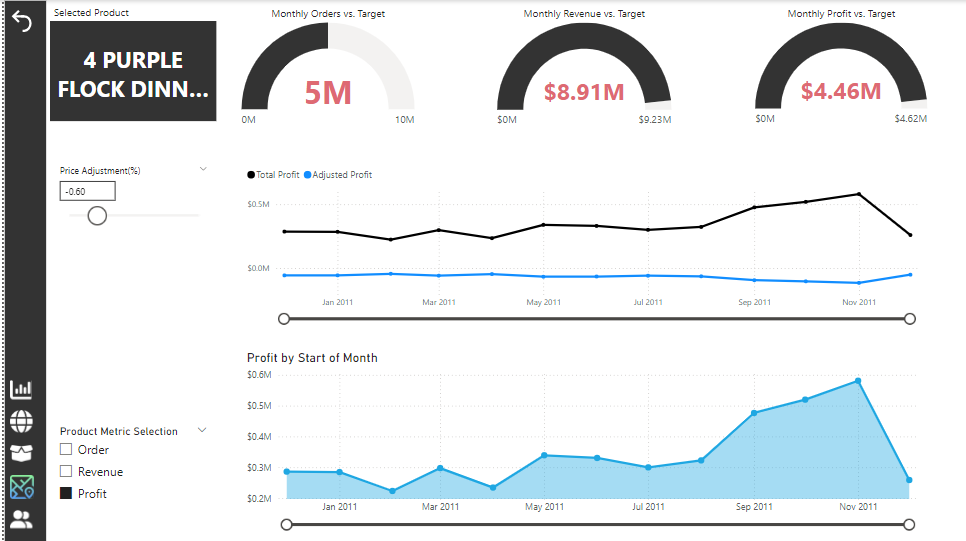
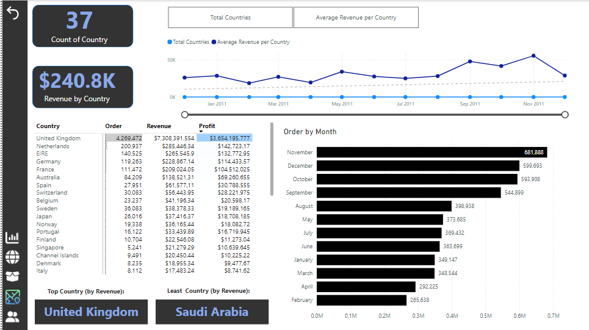
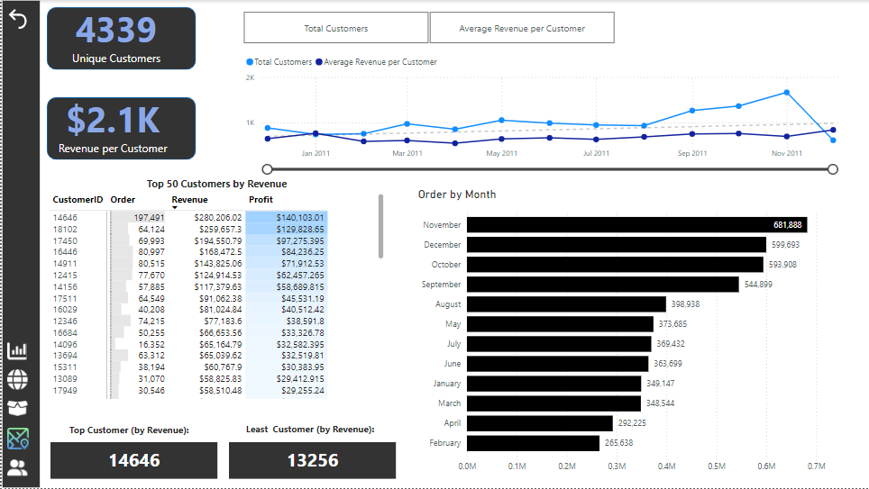

# TATA Online Sales Analysis
This is Online Sales Analysis project for TATA group
## Introduction
The Tata Group and Quants, a leading online retail store, are currently experiencing robust performance across multiple regions and stores. They have engaged our team to deliver strategic insights for their leadership. The management is keen to dive deeper into the factors driving this success, with the objective of leveraging these insights for informed planning in the upcoming year, focusing on both operational efficiency and marketing effectiveness.

In addition to identifying the key drivers behind their current performance, they are particularly interested in exploring demographic trends to gain a deeper understanding of their customer base. The goal is to highlight what's working well while uncovering untapped growth opportunities. Our analysis will play a pivotal role in guiding the company’s expansion strategy, equipping leadership with data-driven insights to make well-informed decisions for future growth.

## Problem Statement
- Monthly Revenue : Identify peak months and reasons behind any trends.
- Product Demand by Region: Identify revenue, profit  with high demand for potential business expansion.
- Top Countries : Rank by revenue, compare with quantity sold, focus on high-revenue and high-quantity sold in each country.
- Top Customers: Rank by revenue, visualize in descending order, targeted for retention.

## Extraction, Transformation and Loading of Data
The datasets were sourced from an `Excel file`, and several key data transformation steps were performed using the Power Query Editor to ensure the data was clean, accurate, and ready for analysis.

The transformation process began with data cleaning to enhance data quality. This involved removing null values and eliminating empty spaces within data rows, ensuring consistency and completeness across the dataset. By addressing these inconsistencies, the data was optimized for analysis, reducing the risk of errors or inaccurate insights.

These steps are critical for preparing high-quality data that supports reliable and meaningful results in downstream analysis.
## Skills/concepts demonstrated:
The following Power Bi features were incorporated
-  Bookmarking and Filtering
-  DAX and Quick measures
-  Page Navigation
## The Logic
- A monthly target was fixed at 10% increase of the previous month for Order, Revenue and Profit
- A KPI visual is used to measure performance of the current month to the previous month
- Numeric Range and Field parameters were created for scenario analysis to examine impact on a given output like impact on REVENUE/PROFIT when the price of product is adjusted by a certain percentage
## Visualization
The report comprises of five(5) pages:
- Executive Brief
- Global Map
- Product's details
- Country's details
- Customer's details

You can interact with the report [here](https://app.powerbi.com/view?r=eyJrIjoiYTcyMjgyYWQtYjA0Mi00Y2EwLTlkN2EtYjUyY2Q1YjAzMDdiIiwidCI6ImYzMzNmMDE4LWE3OTYtNGQ5Yy1iNmM4LThmY2RmYzAyNzEwYiJ9)

### Executive Brief
The visuals provide a comprehensive overview of key business performance indicators, focusing on both monthly trends and product-level insights. They illustrate the monthly revenue trend, showing how income has fluctuated over time. Additionally, the dashboard highlights total orders, total revenue, and total profit, offering a clear snapshot of overall business performance.

One of the visualizations focuses on the top 100 products, ranked by the revenue generated. This helps identify which products are driving the most income, offering valuable insight for decision-making regarding inventory management, marketing strategies, and sales focus.

Furthermore, the visuals compare current month performance to the previous month across three critical metrics: revenue, orders, and profit. This comparison allows for quick identification of growth or decline, enabling swift responses to emerging trends, whether positive or negative.

This data-driven approach helps stakeholders monitor key performance areas, assess the impact of strategic changes, and optimize resource allocation for sustained growth.

### Global Map
This visual highlights the global reach of TATA Company, showcasing the different countries that patronize its products or services. The bubble chart effectively represents each country's level of engagement, where the size of each bubble corresponds to the volume of patronage or sales from that country.

Larger bubbles signify countries with higher volumes of business, indicating major markets for TATA, while smaller bubbles highlight regions with lower levels of engagement. This visual offers a clear and immediate understanding of the company’s global market distribution, helping to identify key markets where TATA enjoys significant patronage, as well as potential growth opportunities in less-engaged regions.

This insight is invaluable for strategic planning, allowing the company to optimize market efforts, allocate resources efficiently, and potentially explore areas for expansion.

### Product's details
This visual provides a detailed performance overview of a specific product, offering a deep dive into its key metrics. By using the drillthrough feature from the Executive Brief, users can seamlessly transition to this detailed product view, where they can evaluate the performance of the selected product across multiple dimensions.

The visual compares the product’s current month performance to a predefined target—set at a 10% increase over the previous month for revenue, orders, and profit. This allows users to quickly assess whether the product is on track to meet growth objectives, helping them understand the effectiveness of pricing strategies, promotional efforts, or market demand.

Additionally, the visual presents a monthly breakdown of the product's revenue, orders, and profit, offering a granular look at how the product has performed over time. This helps identify seasonal patterns, sudden spikes, or declines in performance, providing valuable insights for future planning.

Furthermore, the visual includes a monthly profit trend that specifically tracks the impact of price adjustments on the product's profitability. This feature enables decision-makers to understand how changes in pricing strategy affect both margins and overall performance, giving them the tools to fine-tune pricing and maximize profit.

Overall, this visualization provides a powerful, data-driven perspective, allowing stakeholders to make informed decisions about product performance and strategies for growth

### Country's details
This visual offers a detailed breakdown of the performance of each country in terms of revenue, orders, and patronage, providing a country-specific view of business activity. By showcasing the performance across various countries, stakeholders can identify key markets, emerging regions, and areas of opportunity or concern.

The visual also highlights the months with the highest and lowest patronage, allowing for the identification of peak seasons, off-peak periods, and potential seasonal trends that influence customer behavior in different regions. This insight is crucial for planning marketing campaigns, optimizing inventory, and aligning supply chains with demand fluctuations across countries.

Additionally, the visual incorporates a period trend that tracks revenue performance over time based on the selected criteria in the matrix. This trend analysis allows users to visualize how revenue has evolved over the chosen period, whether it’s month-over-month, quarter-over-quarter, or year-over-year. By adjusting the selection matrix, stakeholders can customize the view to focus on specific timeframes, helping them assess the impact of strategic initiatives, external factors, or market changes.

Together, these visuals provide a powerful, interactive way to monitor geographical performance trends, helping decision-makers tailor their strategies to maximize revenue, improve customer engagement, and drive growth in specific countries and regions

### Customer's details
This visual provides a comprehensive look at the performance of the top 50 customers, represented by their unique Customer IDs. By focusing on this key group, the visual offers insights into the purchasing behavior of the company's most valuable customers, enabling targeted analysis of how these top clients contribute to overall revenue.

The visual highlights the months with the highest and lowest patronage, allowing users to quickly identify when each of these customers is most active and when engagement drops. This can be particularly useful for spotting seasonal trends, understanding customer purchasing cycles, and identifying opportunities to boost engagement during low-activity periods.

Additionally, the visual presents a revenue period trend, which dynamically adjusts based on the selection matrix. This trend line tracks how revenue from the top 50 customers evolves over a chosen period—whether it's month-to-month, quarter-to-quarter, or year-over-year. By allowing users to filter and analyze specific timeframes, the visual helps assess the impact of sales campaigns, product launches, or other initiatives on customer purchasing behavior.

This analysis provides valuable insights into customer loyalty, purchasing patterns, and revenue contribution, offering a data-driven foundation for customer retention strategies, personalized marketing efforts, and growth initiatives aimed at the company’s most critical clients

## Findings from the Analysis
`Revenue Trends`
  - Overall Decline: Total Revenue showed a 9.52% decrease from December 1, 2010, to December 1, 2011, signaling a downward trend during this period. This decline could be indicative of     challenges in maintaining consistent sales or market saturation.
  
  - Recovery and Surge: After bottoming out, revenue started increasing significantly from June 1, 2011, with a 75.71% rise over the next five months, a notable recovery after earlier       stagnation. The revenue increased by $500,603.69, suggesting that strategic interventions or seasonal demand may have played a role.
  
  - Steepest Revenue Jump: The most dramatic rise occurred between June 1, 2011, and November 1, 2011, with revenue growing from $661,213.69 to $1,161,817.38, representing a 75.7%
    increase. This period might correspond with key marketing campaigns, product launches, or favorable market conditions.
  
  - Exceeding the Revenue Target: By achieving $8,911,407.904 in Total Revenue, the business surpassed its target of $8,393,215.114 by 6.16%. This suggests successful efforts in revenue     generation, possibly through promotions, high-demand products, or new market entries.

`Product-Specific Performance`
  - PAPER CRAFT, LITTLE BIRDIE Dominance: The product PAPER CRAFT, LITTLE BIRDIE generated $168,469.60, significantly outperforming other items. This represented a 5.6 billion% increase     over the lowest performer, PADS TO MATCH ALL CUSHIONS, which had a negligible Total Revenue of $0.003. Such disparity highlights the varying demand and effectiveness of different        product lines.

  - Revenue Disparity: The difference between the top and bottom products reflects a stark contrast in sales success. It's essential to investigate why certain products underperform       and how resources can be reallocated or marketing strategies adjusted to enhance their appeal.

`Regional Performance`
- United Kingdom as the Leading Market: The UK had the highest total orders, reaching 4,269,472, accounting for 82.40% of all orders. This dominant position suggests a strong market
  presence in the UK, where the brand's penetration or demand appears robust.

- Market Contrast: The performance in the UK is contrasted with that of Saudi Arabia, which recorded the lowest number of orders at just 80. This 5.3 million% gap between the highest
  and lowest markets underscores the uneven global presence, indicating potential for growth in regions like Saudi Arabia.

- Order Distribution: Across all 37 countries, total orders varied widely, ranging from 80 to 4.27 million, showcasing the brand’s varying degrees of market penetration globally. This
  wide distribution could guide where resources are better allocated for maximum return.

`Seasonality in Sales`
  - November as Peak Month: November saw the highest number of orders at 681,888, which was 156.70% higher than February, the lowest month with 265,638 orders. November's peak may
  coincide with holiday season shopping, promotional activities, or significant campaigns.

- Monthly Order Distribution: November accounted for 13.16% of all orders, indicating a seasonal spike. This pattern suggests that efforts should focus on ramping up marketing and
  inventory ahead of this peak period to capitalize on consumer behavior trends.

`Customer-Specific Insights`
- Top Customer Performance: Customer ID 14646 generated the highest revenue, contributing $280,206.02. The comparison with Customer ID 13256, which generated $0, presents an "infinity"    difference due to zero sales from this customer.

- Customer Value Disparity: This vast disparity suggests the presence of high-value customers driving significant portions of revenue, possibly due to bulk purchases or frequent
  transactions. Targeted strategies like loyalty programs or personalized marketing for these high-value customers can enhance retention and spending.

`Conclusion`
TATA Online Sales experienced a rollercoaster performance between 2010 and 2011. Despite an overall dip in revenue, strong recovery in the latter half of 2011 allowed the business to surpass its revenue targets. The large variations across products, regions, and customer behavior emphasize the need for more focused marketing strategies, regional expansion efforts, and seasonal preparation to sustain growth
