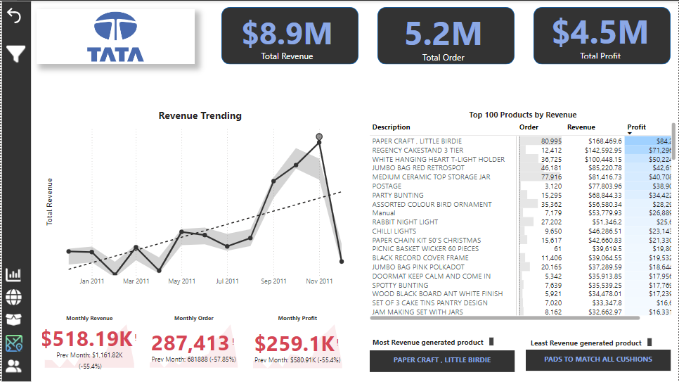
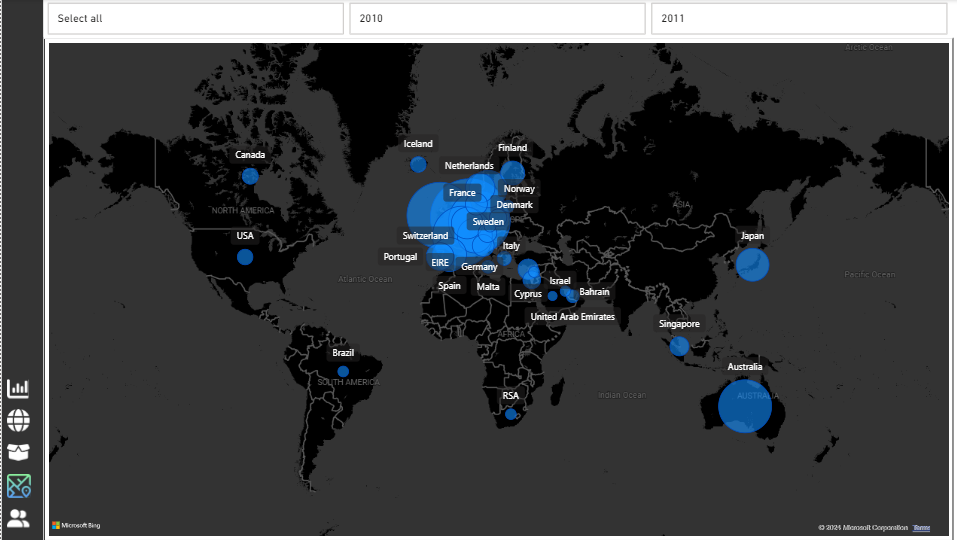

# TATA Online Sales Analysis
This is Online Sales Analysis project for TATA group
## Introduction
The Tata Group and Quants, a leading online retail store, are currently experiencing robust performance across multiple regions and stores. They have engaged our team to deliver strategic insights for their leadership. The management is keen to dive deeper into the factors driving this success, with the objective of leveraging these insights for informed planning in the upcoming year, focusing on both operational efficiency and marketing effectiveness.

In addition to identifying the key drivers behind their current performance, they are particularly interested in exploring demographic trends to gain a deeper understanding of their customer base. The goal is to highlight what's working well while uncovering untapped growth opportunities. Our analysis will play a pivotal role in guiding the company’s expansion strategy, equipping leadership with data-driven insights to make well-informed decisions for future growth.

## Problem Statement
- Monthly Revenue : Identify peak months and reasons behind any trends.
- Product Demand by Region: Identify revenue, profit  with high demand for potential business expansion.
- Top Countries : Rank by revenue, compare with quantity sold, focus on high-revenue and high-quantity sold in each country.
- Top Customers: Rank by revenue, visualize in descending order, targeted for retention.

## Extraction, Transformation and Loading of Data
The datasets were extracted from an Excel file, and the following transformations were performed using the Power Query Editor:
Cleaning the data given in an Excel spreadsheet to ensure good quality data is retrieved by removing the null and empty spaces within data rows.
## Skills/concepts demonstrated:
The following Power Bi features were incorporated
-  Bookmarkig and Filtering
-  DAX and Quick measures
-  Page Navigation
## The Logic
- A monthly target was fixed at 10% increase of the previous month for Order, Revenue and Profit
- A KPI visual is used to measure performance of the current month to the previous month
- Numeric Range and Field parameters were created for scenario analysis to examine impact on a given output like impact on REVENUE/PROFIT when the price of product is adjusted by a certain percentage
## Visualization
The report comprises of four(4) pages:
- Executive Brief
- Global Map
- Product's details
- Country's details
- Customer's details

You can interact with the report [here](https://app.powerbi.com/view?r=eyJrIjoiMGRhZTNmMTQtMDIyZC00ZGE5LTkyMWUtM2JkYTkwYTRhOTkyIiwidCI6ImYzMzNmMDE4LWE3OTYtNGQ5Yy1iNmM4LThmY2RmYzAyNzEwYiJ9)

### Executive Brief
The visuals provide a comprehensive overview of key business performance indicators, focusing on both monthly trends and product-level insights. They illustrate the monthly revenue trend, showing how income has fluctuated over time. Additionally, the dashboard highlights total orders, total revenue, and total profit, offering a clear snapshot of overall business performance.

One of the visualizations focuses on the top 100 products, ranked by the revenue generated. This helps identify which products are driving the most income, offering valuable insight for decision-making regarding inventory management, marketing strategies, and sales focus.

Furthermore, the visuals compare current month performance to the previous month across three critical metrics: revenue, orders, and profit. This comparison allows for quick identification of growth or decline, enabling swift responses to emerging trends, whether positive or negative.

This data-driven approach helps stakeholders monitor key performance areas, assess the impact of strategic changes, and optimize resource allocation for sustained growth.

### Global Map
This visual highlights the global reach of TATA Company, showcasing the different countries that patronize its products or services. The bubble chart effectively represents each country's level of engagement, where the size of each bubble corresponds to the volume of patronage or sales from that country.

Larger bubbles signify countries with higher volumes of business, indicating major markets for TATA, while smaller bubbles highlight regions with lower levels of engagement. This visual offers a clear and immediate understanding of the company’s global market distribution, helping to identify key markets where TATA enjoys significant patronage, as well as potential growth opportunities in less-engaged regions.

This insight is invaluable for strategic planning, allowing the company to optimize market efforts, allocate resources efficiently, and potentially explore areas for expansion.

